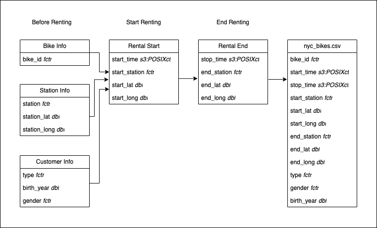

```{r echo=FALSE, message=FALSE}
library(leaflet)
library(lubridate)
library(slider)
library(tidyverse)
library(tsibbledata)
library(tsibble)
nyc_bikes_df <- nyc_bikes
```

```{r echo=FALSE, eval=FALSE}
head(nyc_bikes_df)
index_var(nyc_bikes_df)
key_vars(nyc_bikes_df)
```


---

# 1. Documentation

## 1.1. Domain Knowledge  

[Citi Bike](https://citibikenyc.com/homepage) is New York City’s bike share system, and the largest in the USA. It launched in 2013 and has become an essential part of the transportation network. In 2015 it saw **10 millions of trips in a year** and in 2020 hit the **100 millions of trips** milestone.

Citi Bike consists of a fleet of thousands of bikes that are locked into a network of hundreds of docking stations across Manhattan, Brooklyn, Queens and Jersey City. The bikes can be unlocked from one station and returned to any other station in the system, making them ideal for one-way trips. People use bike share to commute to work or school, run errands and much more.

Citi Bike plans are available as a Single Ride (\$3.99), Day Pass (\$15.00), Year Pass (\$185.00), and a special discounted pass for New York City Housing Authority (NYCHA) and Jersey City Housing Authority (JCHA) residents (\$5.00/month).  
All passes are strongly designed for short rides, as there is a charge of 23 cent/minute aver the first 30 minutes.


## 1.2. Business requirements  

The aim of this report is to identify patterns of bike hires over time (specifically over the year and weekdays), with attention to users demographics (gender).


## 1.3. Business processes and data flow  

Below is a diagram that shows how the Citi Bike dataset was created.  
The "before renting" information exists in the company database before renting a bike; further information is added when a customer starts renting and again upon returning.  



*This diagram was created using draw.io at https://app.diagrams.net*

## 1.4. Data visualisation as a tool for decision-making  

The visualisations in this report aim to provide a few insights about renting patterns and customer distribution in a given year (2018), with the goal of enabling the company to make informed business decisions and increase bike hires and revenue. However, due to the original dataset being limited in scope (only 10 bikes, all located in Jersey City, over a fleet of thousands spread across the city), we recommend to limit policy decisions to the area covered by the available data or, alternatively, collect more data.  

## 1.5. Data types 

column name    | data type    |
-------------- | ------------ |
bike_id        | fctr         |
start_time     | S3: POSIXct  |
stop_time      | S3: POSIXct  |
start_station  | fctr         |
start_lat      | dbl          |
start_long     | dbl          |
end_station    | fctr         |
end_lat        | dbl          |
end_long       | dbl          |
type           | fctr         |
birth_year     | dbl          |
gender         | fctr         |

**Double (dbl)**: Double (double precision floating point numbers) are decimal numbers. They are used for *continuous data* such as measurements, therefore their values can’t be counted but they can be measured. An example would be the height of a person, which you can describe by using intervals on the real number line. The two most common numeric classes used in R are double and integer (whole numbers).

**Factor (fctr)**: Factors are used to represent categorical data and they can be ordered or unordered. Factors are stored as integers, and have labels associated with these unique integers. While factors look like character vectors, they are actually integers under the hood.
Once created, factors can only contain a pre-defined set values, known as *levels*. By default, R always sorts levels in alphabetical order, but they can be *ordered* in a different way.

**POSIXct (S3: POSIXct)**: Data class for calendar dates and times with an associated time zone. These are stored in seconds with the number of seconds beginning at 1 January 1970.


## 1.6. Data quality and data bias

### Data quality
There are no concerns on ethics, as the dataset is fully anonymised.   

### Possible data biases
- The dataset is limited to a sample of 10 bikes only.  
- The dataset is limited to 2018; therefore, seasonality over the years cannot be analysed.  
- The dataset is limited to Jersey City, which constitutes a partially representative sample of the users' population. This might result in a biased analysis.

Moreover, because of the geographical limitation, we are not in a position to expand our analysis to the wider Citi Bike network.


---

# 2. Data Cleaning


## 2.1. Preparing data for visualisation  

To perform an analysis over time (time series) I have added the relevant columns.

1. start date:  
  - day of the week  
  - day of the month  
  - week of the year  
  - month  
  - year  
2. end date:  
  - day of the week  
  - day of the month  
  - month  
3. duration of the ride  

```{r}
nyc_bikes_time <- nyc_bikes_df %>% 
  mutate(start_date = as_date(start_time),
         start_weekday = weekdays(start_time),
         start_day = day(start_time),
         start_week_number = yearweek(start_time),
         #start_week_number = format(as.Date(start_time), "%V"),
         start_month = month(start_time, label =  TRUE, abbr = FALSE),
         year = year(start_time),
         end_date = as_date(stop_time),
         stop_weekday = weekdays(stop_time),
         stop_day = day(stop_time),
         stop_month = month(stop_time, label =  TRUE, abbr = FALSE),
         duration_min = as.numeric(as.period(stop_time - start_time), "minutes"))
```


---

# 3. Data Visualisation  


## 3.1. Process and design  

First, I investigated the dataset with simple single-variable distribution plots. Then I plotted variables of interest to Citi Bike to detect any patterns. After selecting key visualisations, I ensured these were clearly portraying the message I wanted to convey, were aesthetically pleasing, as well as accurate and not misleading. All visualisations were made in RStudio using the `ggplot` and `leaflet` packages.


## 3.2. Visualisations  


```{r}
nyc_bikes_time %>% 
  index_by(start_date) %>%
  summarise(daily_hire = n()) %>% 
  mutate(
    daily_hire_moving_avg = slide_dbl(
      .x = daily_hire, 
      .f = ~ mean(., na.rm = TRUE),
      .before = 7,
      .after = 7
    )
  ) %>% 
  ggplot() + 
  geom_line(aes(x = start_date, y = daily_hire), colour = "grey") +
  geom_line(aes(x = start_date, y = daily_hire_moving_avg), colour = "red") +
  theme(
    plot.margin = unit(c(1, 1, 1, 1), "lines"),
    axis.title.x = element_text(vjust = -2),
    axis.title.y = element_text(vjust = 2)
  ) +
  labs(title = "Yearly Bike Hire", subtitle = "Citi Bike (2018)", x = "Hire Start Date", y = "Daily Hire Count")
```

The above line chart shows the total hires for each day of the year. There is a clear increase between April and August, then a slow decrease towards the end of the year.  
The red line shows a moving average over a 14-day window: each point represents the average rentals for the previous and following week, each day of the year. A moving average allows us to visualise how an average changes over time, which is very useful in cutting through the noise of individual data points.

The yearly hire trend does show a pattern, which we'll analyse in more detail in the next chart.


```{r}
nyc_bikes_time %>% 
  index_by(start_date) %>%
  summarise(daily_hire = n()) %>% 
  mutate(start_month = month(start_date, label =  TRUE, abbr = FALSE),
         start_day = day(start_date)) %>% 
  ggplot() + 
  geom_col(aes(x = start_day, y = daily_hire), colour = "steelblue") +
  facet_wrap(~ start_month) +
  theme(
    plot.margin = unit(c(1, 1, 1, 1), "lines"),
    axis.title.x = element_text(vjust = -2),
    axis.title.y = element_text(vjust = 2)
  ) +
  labs(title = "Monthly Bike Hire", subtitle = "Citi Bike (2018)", x = "Day of the Month", y = "Daily Hire Total")
```

With the above faceted bar chart we can compare differences and patterns of bike hires for each month and identify any gaps (days with no bike hires, which may be due to roadworks, severe weather conditions or other factors, requiring further investigations).  
We can confirm that the majority of customers use bikes over the summer season. 

The relationship between seasons and bike hire, visible in both charts, can be used by the business to create targeted promotions and discounts to encourage customers to use bikes over autumn and winter, as well as make better predictions of customer behaviour, therefore better planning (e.g., on bike availability and maintenance).

```{r}
nyc_bikes_time %>% 
  mutate(start_weekday = factor(start_weekday, levels = c("Monday", "Tuesday", "Wednesday", "Thursday", "Friday", "Saturday", "Sunday"))) %>% 
  group_by(start_weekday) %>%
  summarise(daily_hire = n()) %>% 
  ggplot() + 
  geom_col(aes(x = start_weekday, y = daily_hire), colour = "steelblue") +
  theme(
    plot.margin = unit(c(1, 1, 1, 1), "lines"),
    axis.title.x = element_text(vjust = -2),
    axis.title.y = element_text(vjust = 2)
  ) +
  labs(title = "Hire distribution by weekday", subtitle = "Citi Bike (2018)", x = "Weekday", y =  "Total Rides")
```

The above bar chart shows that during weekdays hires were higher than during weekends; this suggests that City Bike is used mainly for commuting. To further support this hypothesis, we have created the below map with starting stations.  


```{r}
start_stations <- nyc_bikes_time %>% 
  distinct(start_station, start_lat, start_long)

start_point_map <- leaflet(start_stations) %>%
  addTiles() %>%
  addCircleMarkers(lng = ~ start_long, lat = ~ start_lat,
                   clusterOptions = markerClusterOptions())

start_point_map
```
The above map shows how the starting stations are more concentrated in the financial and commercial centre of the city (The Exchange Place, Harborside Financial Centre and Newport Centre Mall). This confirms our hypothesis of City Bike being used mainly for commuting.  

The company might use this insight to expand their customer network to the tourism and leisure sector, by designing targeted advertisements and promotions, especially over autumn/winter when, as we have just seen, the bike hire numbers see a decrease.    


```{r}
nyc_bikes_time %>%
  filter(gender != "Unknown") %>% 
  group_by(gender) %>% 
  index_by(start_date) %>%
  summarise(daily_hire = n()) %>% 
  mutate(
    daily_hire_moving_avg = slide_dbl(
      .x = daily_hire, 
      .f = ~ mean(., na.rm = TRUE),
      .before = 7,
      .after = 7
    )
  ) %>% 
  ggplot() + 
  geom_line(aes(x = start_date, y = daily_hire), colour = "grey") +
  geom_line(aes(x = start_date, y = daily_hire_moving_avg), colour = "red") +
  facet_wrap(~ gender) +
  theme(
    panel.spacing = unit(2, "lines"),
    plot.margin = unit(c(1,1,1,1), "lines"),
    axis.title.x = element_text(vjust = -2),
    axis.title.y = element_text(vjust = 2)
  ) +
  labs(title = "Bike Hire Variations by Users' Gender", subtitle = "Citi Bike (2018)", x = "Hire Start Date", y = "Hire Count")
```

The above line charts shows that users are predominantly men.  

According to the [American Community Survey's 2014–2018 estimates](https://data.census.gov/cedsci/table?q=Jersey%20City%20city,%20New%20Jersey%20median%20age&g=1600000US3436000&tid=ACSST1Y2018.S0101&t=Age%20and%20Sex&layer=VT_2018_160_00_PY_D1), in Jersey City females made up 50.8% of the population and there were 100.1 males per 100 females.

This means that the result shown in the graph is not due to the city demographics (there is an equal proportion of males and females within the population), therefore we can say that men use Citi Bike significantly more than women.  
These highlights can be used by the business to create better targeted advertisements or promotions addressing this gap, e.g. by partnering with shops or facilities mainly visited by women.  

# 4. Additional notes

From the American Community Survey's estimates above, we also gather that in 2018 Jersey City's median age was 34.2 years, and the age distribution was:  
- 7.7% of the population under 5  
- 13.2% between 6–18  
- 69% from 19 to 64  
- 10.1% 65 years of age or older  

This data could be compared to the age distribution among Citi Bikes' customers, to gain additional insights (not included in this report).  


--- 